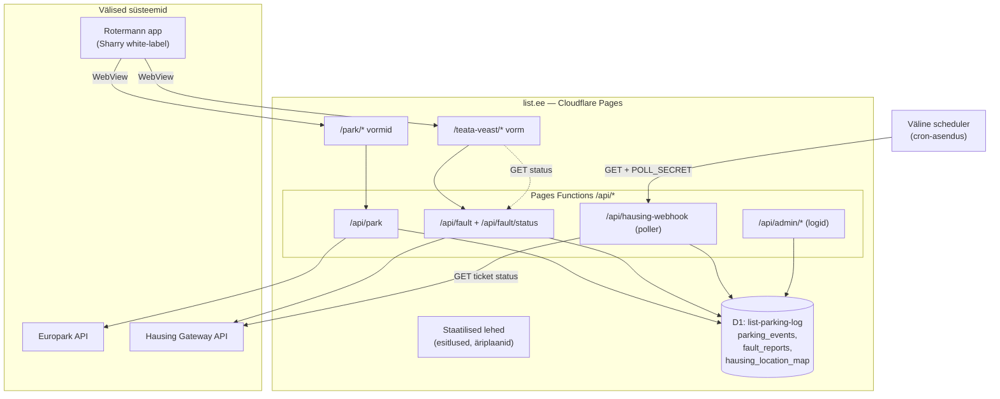

# list.ee — süsteemide kaart ja seosed

See dokument kirjeldab, **mis süsteemid meil on, kus nad elavad ja kuidas omavahel seotud on**.
Tehniline detail iga integratsiooni kohta on viidatud alamdokumentides.

## Suur pilt

`list.ee` on Cloudflare Pages peal jooksev platvorm, mis täidab kahte rolli:

1. **Teenuste backend** Rotermanni äpile — väikesed veebivormid + API-funktsioonid, mida
   Rotermanni äpp (Sharry) avab WebView'is. Praegu: külaliste parkimine (Europark) ja
   veateated (Hausing).
2. **Esitlus- ja äridokumentide host** — äriplaanid, lojaalsusprogrammi materjalid,
   infra-esitlused (staatilised HTML-lehed).

## Mõisted — kes on kes

| Nimi | Mis see on | Kelle oma |
|---|---|---|
| **Rotermann app** | Rotermanni rentnike äpp. Tehniliselt **Sharry** tarkvara white-label. | Sharry (väline) |
| **Sharry** | Workplace/tenant-experience platvorm. Avab meie vorme WebView'is, edastab kasutaja konteksti URL-i query-parameetritena. | Sharry (väline) |
| **list.ee** | Meie Cloudflare Pages platvorm — vormid, API, esitlused. | Meie |
| **Europark** | Parkimisteenuse API (külaliste parkimine). | Europark (väline) |
| **Hausing** | Kinnisvarahalduse tarkvara. Veateated = "general tickets". Haldus lahendab seal. | Hausing (väline) |

## Integratsioon 1 — Külaliste parkimine (Europark) [LIVE]

- Sissevõtt: `/park/usre-h3k9m2/` ja `/park/us-invest-p7n5q8/` vormid (Sharry WebView).
- Backend: `functions/api/park.ts` → Europark API (Bearer-võti serveris).
- Audit: D1 `parking_events`. Admin: `GET /api/admin/logs`.
- Detailid: [park/SETUP.md](../park/SETUP.md).

## Integratsioon 2 — Veateated (Hausing) [EHITATUD, ootab API-võtmeid]

- Sissevõtt: `/teata-veast/` vorm (Sharry WebView), kasutaja `User e-mail` → Hausingu `watcherEmail`.
  Vorm võtab ka **valikulise foto** (klient skaleerib alla + eemaldab EXIF, saadab base64).
- Backend: `functions/api/fault.ts` → `POST /v1/general-tickets`. Klient: `functions/api/_hausing.ts`.
  Foto seotakse ticketiga 3-sammulise failivooga (`uploadTicketPhoto`), best-effort.
- Staatuse tagasivool: `functions/api/hausing-webhook.ts` poller (Hausing **ei paku webhooke**)
  + `functions/api/fault/status.ts` elaniku vaade. Audit/mapping: D1 `fault_reports`,
  `hausing_location_map`. Admin: `GET /api/admin/fault-logs`.
- **NB:** Cloudflare Pages Functions ei toeta cron-triggereid — polleri käivitab väline
  scheduler (`GET /api/hausing-webhook` + `POLL_SECRET`).
- Detailid: [integrations/HAUSING_API.md](integrations/HAUSING_API.md),
  [integrations/SHARRY_INTEGRATION.md](integrations/SHARRY_INTEGRATION.md),
  spec + plaan kaustas [superpowers/](superpowers/).

## Andmebaas (D1)

Üks D1 andmebaas `list-parking-log` (binding `DB`), tabelid:
- `parking_events` — parkimise audit (migration 0001).
- `fault_reports` — veateadete audit + Sharry↔Hausing ticket-mapping + staatuse cache (0002).
- `hausing_location_map` — Sharry asukoht → Hausing building/room id (0002).

Skeemimuudatused: [migrations/README.md](../migrations/README.md).

## Deploy ja keskkonnad

- Hosting: Cloudflare Pages, projekt `list`, production branch `main`, juur = saidi juur
  (`pages_build_output_dir = "."`).
- Secrets (dashboardis): `EUROPARK_API_KEY_5/_6`, `HAUSING_API_TOKEN`, `HAUSING_COMPANY_ID`,
  `POLL_SECRET`, `CF_ADMIN_KEY`. Lokaalselt `.dev.vars` (gitignored).
- Mitte-salajased vars: `wrangler.toml` `[vars]`.
- Lokaalne arendus: `npm run dev` (`wrangler pages dev`). Tüübikontroll: `npm run typecheck`.

## Äri- ja esitlusmaterjal

Äriplaanid, pakkumised, lojaalsusprogrammi materjalid ja disainifailid on suures osas
**lokaalsed/gitignore'itud** (ainult avalikud esitluslehed on commit'itud ja deploy'tud).
Vt repo struktuuri [README.md](../README.md) failist.
