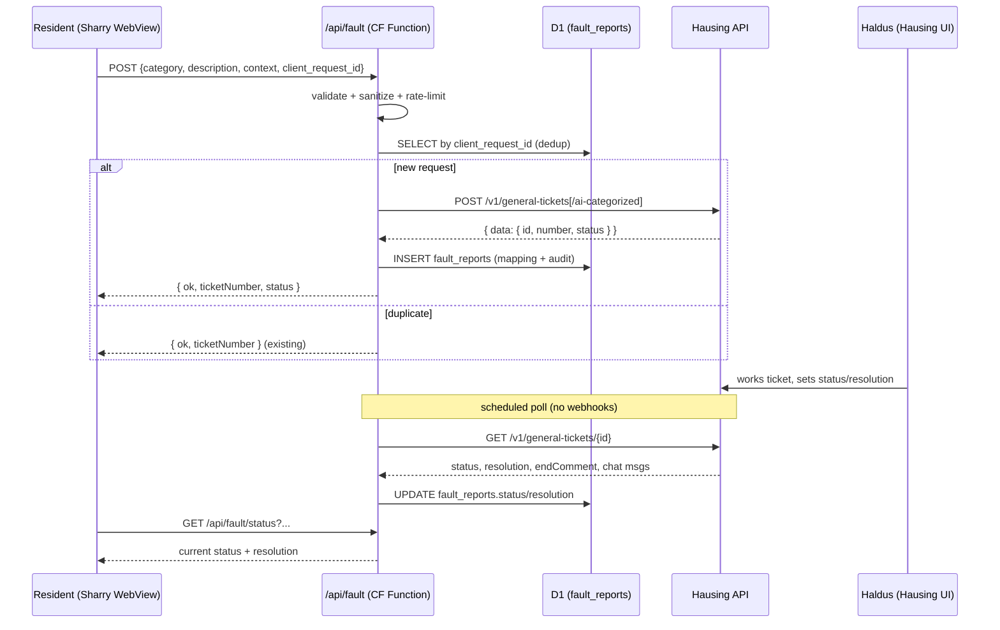

# Sharry -> Hausing Fault Report Relay (Design Spec)

**Date:** 2026-06-16
**Status:** Approved design, pending live API keys for end-to-end testing.
**Repo:** the-list-services (Cloudflare Pages Functions + D1)
**References:** [HAUSING_API.md](../../integrations/HAUSING_API.md), [SHARRY_INTEGRATION.md](../../integrations/SHARRY_INTEGRATION.md), existing pattern `functions/api/park.ts`.

---

## 0. Summary

Residents report building faults from the Rotermann app (white-label Sharry). A fault report
becomes a **General ticket** in Hausing, the property manager (haldus) works it inside Hausing,
and the status + resolution flow back to the resident. The relay is a thin, auditable Cloudflare
Pages Function that mirrors the existing guest-parking proxy: it holds the Hausing credentials
server-side, validates and sanitizes input, writes an audit/mapping row to D1, and never leaks
upstream internals to the client.

No calculation or business logic beyond mapping + relaying. Hausing remains the system of record
for tickets; D1 holds only the cross-system mapping, status cache, and audit trail.

---

## 1. Decisions captured

| Topic | Decision |
|---|---|
| Fault report target | Hausing **General ticket** (`POST /v1/general-tickets`). Maintenance tickets are read-only over the API and not used. |
| Ingress | Sharry WebView -> static form -> `POST /api/fault`. Same pattern as guest parking; no inbound Sharry API. |
| Host / runtime | Cloudflare Pages Function + D1, region EEUR. Reuse `park.ts` conventions verbatim. |
| Auth to Hausing | Header `Authentication: Bearer <JWT>` + `X-Hausing-Company: <id>`, both server-side secrets/vars. JWT acquisition method TBD with vendor. |
| Categorization | Default to `POST /v1/general-tickets/ai-categorized` (no category-mapping table to maintain). Fall back to explicit `categoryId` from tenant-visible categories if AI categorization is disabled. |
| Resident identity | Sharry `User e-mail` -> Hausing `watcherEmail`. This is the cross-system key for notifications + chat. |
| Building/room mapping | Static Sharry-location -> Hausing `buildingId`/`roomId` map (D1 table `hausing_location_map`) for the Rotermann pilot. Runtime resolution via `GET /v1/buildings` is a later option. |
| Status round-trip | **Polling** (Hausing has no webhooks). Scheduled read of ticket status + new chat messages -> update D1 -> resident sees status in the WebView. |
| Idempotency | No native dedup in Hausing. Enforce with a `client_request_id` (UUID minted client-side per submit) unique in D1; refuse duplicate creates. |
| Attachments | Optional, phase 2. Two-step file upload (`GET /v1/files/upload-url` -> PUT -> `POST /v1/files` with `entity=GENERAL_TICKET`). |
| Secrets | `HAUSING_API_TOKEN`, `HAUSING_COMPANY_ID` as Cloudflare secrets; `.dev.vars` locally (gitignored). Never in client code or git. |
| Failure stance | Creating a ticket is the critical path: if Hausing is down, return a clear retryable error and log; do NOT silently drop. Audit writes are fail-open (never block the user response), same as parking. |

---

## 2. Data flow



---

## 3. D1 schema (migration 0002)

### 3.1 `fault_reports`

| Column | Type | Notes |
|---|---|---|
| `id` | INTEGER PK AUTOINCREMENT | |
| `ts` | TEXT NOT NULL | ISO 8601 created time |
| `client_request_id` | TEXT | UUID from client; dedup key (UNIQUE) |
| `event` | TEXT NOT NULL | `fault.ok`, `fault.upstream_error`, `fault.validation_error`, `fault.misconfig`, `fault.rate_limited` |
| `hausing_ticket_id` | INTEGER | Hausing `data.id` (int64) |
| `hausing_ticket_number` | TEXT | human-readable `data.number` |
| `hausing_status` | TEXT | last known status enum |
| `resolution` | TEXT | filled when terminal |
| `category` | TEXT | submitted category label/id |
| `title` | TEXT | derived from category/description |
| `description` | TEXT | resident free text (capped) |
| `building_id` | TEXT | resolved Hausing building id |
| `room_id` | TEXT | resolved Hausing room id |
| `watcher_email` | TEXT | resident email (Sharry User e-mail) |
| `user_name` / `user_id` / `tenant_id` / `tenant_name` | TEXT | Sharry context |
| `ip` / `country` / `user_agent` / `referer` | TEXT | CF network audit |
| `raw_context` | TEXT | full sanitized Sharry context JSON |
| `error_code` / `error_message` | TEXT | on failure |
| `duration_ms` | INTEGER | upstream call duration |
| `updated_at` | TEXT | last status poll update |

Indexes: `ts DESC`, `hausing_ticket_id`, `watcher_email`, UNIQUE(`client_request_id`).

### 3.2 `hausing_location_map` (pilot static map)

| Column | Type | Notes |
|---|---|---|
| `sharry_site_id` | TEXT | from Sharry context (`s`/Site ID) |
| `sharry_base_location_id` | TEXT | optional finer key |
| `hausing_building_id` | TEXT | Hausing building id |
| `hausing_room_id` | TEXT | optional default room |
| `label` | TEXT | human note |

Seeded once real Hausing building ids are known. Until then `/api/fault` can accept an explicit
`buildingId` override for testing.

---

## 4. Endpoints (this repo)

| Method | Path | Purpose |
|---|---|---|
| POST | `/api/fault` | Create a fault report -> Hausing general ticket. |
| GET | `/api/fault/status` | Resident reads current status (by `client_request_id` or ticket number + email). |
| GET/POST | `/api/hausing-webhook` | Scheduled/poll worker: refresh status + chat for open tickets. (Name kept generic in case Hausing later adds webhooks.) |
| GET | `/api/admin/fault-logs` | Admin audit view (mirror of `/api/admin/logs`, Bearer `CF_ADMIN_KEY`). |

`POST /api/fault` request body:

```json
{
  "category": "string (optional if AI categorization)",
  "description": "string (required)",
  "client_request_id": "uuid",
  "buildingId": "string (optional override during pilot)",
  "context": { "e": "user@email", "n": "Name", "t": "tenantId", "s": "siteId" }
}
```

Response (success): `{ ok: true, ticketNumber, status: "TO_DO" }`. Client never receives raw
Hausing error bodies.

---

## 5. Validation, security, resilience (inherit from park.ts)

- **Input validation:** `description` required, length-capped; `category` against tenant-visible
  category list (or omitted for AI). Reject empty/oversized payloads with 400.
- **Sanitize context:** reuse `sanitizeContext` (cap keys/length, drop `undefined`/`null`).
- **Rate limit:** per-IP (all events) and per-email (successful creates) via D1 counts, fail-open
  on D1 errors. Tighter email cap than parking (faults are lower-frequency) — e.g. 10/hour/email.
- **Secret hygiene:** Hausing token/company only server-side. Never echo upstream body to client;
  log full detail to D1 + `console.log` for Cloudflare real-time logs.
- **Idempotency:** `client_request_id` UNIQUE; on duplicate POST return the existing ticket.
- **Critical-path failure:** if Hausing create fails, return retryable 502/400 with a friendly
  Estonian message and a logged `fault.upstream_error`; the resident is told to retry, not that it
  succeeded.
- **Audit fail-open:** D1 writes use `ctx.waitUntil` and never block or fail the user response.

---

## 6. Status polling

- The poller endpoint (`GET /api/hausing-webhook`, secret-guarded) selects `fault_reports` with
  non-terminal `hausing_status`, calls `GET /v1/general-tickets/{id}` for each, and updates
  `hausing_status` / `resolution` / `updated_at`.
- Terminal statuses (`DONE`, `NOT_DONE`, `REJECTED`) stop further polling.
- New chat messages (`GET .../chats/messages`) can be surfaced to the resident in the status view.
- Polling cadence: every 15-30 min is enough for a building maintenance workflow; tune later.

> **Constraint (verified during review):** Cloudflare **Pages Functions have no native cron /
> `scheduled` handler** — cron triggers are a Workers-only feature. So the poll must be driven by
> one of:
> 1. An **external scheduler** (GitHub Actions cron, cron-job.org, UptimeRobot) doing an
>    authenticated `GET /api/hausing-webhook` with a `POLL_SECRET` bearer. Simplest; default for the
>    pilot.
> 2. A **separate Cloudflare Worker** with a `scheduled` handler (and a D1 binding) that does the
>    polling directly. Use this if we want everything inside Cloudflare.
>
> Either way the poll logic lives in one place and is idempotent. During dev, just hit the GET
> endpoint manually.

---

## 7. Localization

Resident-facing copy (form labels, status names, error messages) is **Estonian**. Internal logs,
code, and these docs are English (matches KLAARIKS engineering-doc convention). Status enum is
mapped to friendly Estonian: e.g. `TO_DO` -> "Vastu võetud", `IN_PROGRESS` -> "Töös",
`DONE` -> "Lahendatud", `REJECTED` -> "Tagasi lükatud".

---

## 8. Open questions (resolve at/after credential handover)

1. JWT acquisition: static token vs. OAuth2 token exchange/refresh? Affects whether the Function
   needs a token-refresh step.
2. Real Hausing `buildingId`/`roomId` values for Rotermann buildings -> seed `hausing_location_map`.
3. Required custom fields on ticket creation for this Hausing company (`GET .../custom-fields/definitions`).
4. Confirm the auth header name (`Authentication` vs `Authorization`) against a live 200.
5. Whether Hausing can push notifications to the Sharry app, or the WebView status view is the
   only resident-facing channel.
