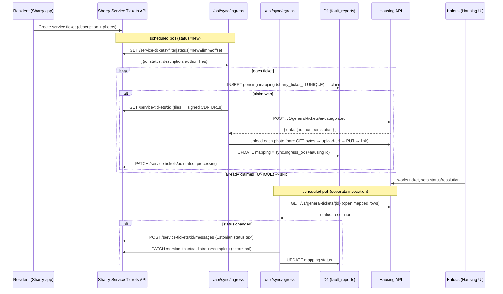

# Sharry ⇄ Hausing Two-Way Fault Sync (Design Spec)

**Date:** 2026-06-16
**Status:** Proposed design — pending Sharry API access (Application token + admin account) and
Hausing API keys for end-to-end testing. Revised after a fresh-eyes plan review (see §9).
**Repo:** the-list-services (Cloudflare Pages Functions + D1)
**References:** Sharry "Workplace Public" API (Postman: `documenter.getpostman.com/view/2800273/SW12ywvF`,
pinned `docs/integrations/sharry-collection.json`), [HAUSING_API.md](../../integrations/HAUSING_API.md),
[SHARRY_API.md](../../integrations/SHARRY_API.md). **Supersedes** the WebView fault-relay spec.

---

## 0. Summary

Residents already report building faults inside the **Rotermann (Sharry) app** using Sharry's
native **Service Tickets** feature (description + photos). There is no custom form to build. The
integration is a thin, auditable **two-way sync** running as Cloudflare Pages Functions:

1. **Ingress (Sharry → Hausing):** poll Sharry for `new` Service Tickets, create a matching Hausing
   **General Ticket** (with the photos), record the mapping in D1, and move the Sharry ticket to
   `processing`.
2. **Egress (Hausing → Sharry):** poll Hausing for status/resolution changes on mapped tickets and
   push them back into the Sharry ticket as a **message** + a **status update**, so the resident
   sees progress natively in the app.

Neither system has webhooks, so both directions are **polling** driven by an external scheduler
(Pages Functions have no cron). Hausing is the system of record for the work; Sharry is the
resident's interface; D1 holds only the mapping, status cache, and audit trail.

---

## 1. Decisions captured

| Topic | Decision |
|---|---|
| Resident entry point | **Sharry native Service Tickets** (in-app). No WebView form. The old `teata-veast/` + `/api/fault*` are removed. |
| Ingress polling | **No time cursor** — the Sharry List endpoint has only `filter[status]`, `filter[site_ids][]`, `filter[type]`, `limit`, `offset` (no `updated_at`/`since`). Poll `filter[status]=new` with `offset` paging. The set is **self-clearing**: once we mirror a ticket and `PATCH new→processing` it leaves the `new` page. |
| Idempotency / dedup | **Claim-first.** `sharry_ticket_id` is UNIQUE in D1. Ingress `INSERT`s a *pending* mapping row (the UNIQUE check fires cheaply) **before** the Hausing create; only then create the ticket and `UPDATE` the row. Prevents overlapping scheduler runs from creating duplicate Hausing tickets. |
| Egress | On Hausing status change → `POST /service-tickets/:id/messages` (resident-visible) + `PATCH /service-tickets/:id` status (`processing`→`complete`). Selects rows by the sync events (NOT `fault.ok`). |
| Hausing target | Hausing **General ticket** (`POST /v1/general-tickets/ai-categorized`), unchanged. |
| Photos | Sharry ticket `files[]` carry **signed, expiring CDN URLs**. Fetch with a **bare GET (no auth headers)** within the same run, then upload to Hausing via the existing 3-step `uploadTicketPhoto`. Best-effort. Never log the signed URLs (capability URLs). |
| Identity | Sharry ticket `author` → resident. `author` exposes `id/fullname/image` only — **no email field**. `watcherEmail` is **optional**: try to resolve it (Core→Users by `author.id`), but if unavailable create the Hausing ticket **without** it (never block ingress). |
| Status mapping | Hausing `IN_PROGRESS`-ish → Sharry `processing`; Hausing terminal → Sharry `complete`. Distinct Estonian messages per terminal: `DONE`→"lahendatud", `NOT_DONE`/`REJECTED`→"ei lahendatud / lükati tagasi" (do not say "lahendatud" for a rejected ticket). |
| Auth (Sharry) | Two headers on every call: `Application-token` (Sharry provides) + `Access-token` (from `POST /token`, `grant_type=admin`; supports `refresh_token`). Token TTL ≈ **1 day**. Cache it in **D1** (`sync_state`), NOT isolate memory (Pages Functions are stateless across invocations); refresh via `refresh_token`, re-auth on 401. **Confirm the admin grant returns a token with no interactive 2FA** (`/verify-code` exists) for the service account. |
| Sharry base URL | `SHARRY_API_BASE` includes the version path, e.g. `…/api/v8`. Sandbox vs prod TBD. |
| Auth (Hausing) | `Authentication: Bearer <JWT>` + `X-Hausing-Company` (unchanged). |
| Rate / subrequest limits | Sharry has a **global hourly cap** (value TBD). Ingress is subrequest-heavy (Show + N file GETs + create + 3 upload calls/photo + PATCH). Keep a **small batch** (≈5/run), honor `429`/`Retry-After`, and **split ingress and egress into separate scheduled invocations** to stay under Cloudflare's per-invocation subrequest/CPU limits. |
| Hosting / runtime | Cloudflare Pages Functions + D1, region EEUR. Two endpoints triggered by an external scheduler with a `SYNC_SECRET` bearer. |
| Failure stance | Mirror-create to Hausing is the critical path — on failure mark the pending row failed and retry next run (Sharry ticket stays `new`). Audit writes are fail-open. |

---

## 2. Data flow

---

## 3. D1 schema (migration 0004 — extend `fault_reports` + add `sync_state`)

Reuse `fault_reports` as the mapping + audit log. Add (append-only, all nullable):

| Column | Type | Notes |
|---|---|---|
| `sharry_ticket_id` | TEXT | Sharry ticket UUID — dedup/claim key |
| `sharry_identifier` | INTEGER | human-readable Sharry number |
| `sharry_status` | TEXT | last seen Sharry status (`new/processing/complete`) |
| `sharry_status_pushed` | TEXT | last status WE pushed to Sharry (avoid redundant PATCH) |
| `last_message_pushed` | TEXT | id/hash of last resolution message pushed (idempotent egress) |

Index: `CREATE UNIQUE INDEX IF NOT EXISTS idx_fault_reports_sharry_ticket ON fault_reports(sharry_ticket_id) WHERE sharry_ticket_id IS NOT NULL` (**partial** — mirrors the existing `client_request_id` index; existing NULL rows don't collide).

New events: `sync.ingress_pending` (claim), `sync.ingress_ok`, `sync.ingress_error`,
`sync.egress_ok`, `sync.egress_error`, `sync.photo_error`, `sync.misconfig`.

`sync_state(key TEXT PRIMARY KEY, value TEXT, updated_at TEXT)` — small KV for the **cached Sharry
access token** (`{token, refreshToken, expiresAt}`) and any future single-flight lock. Not a poll
cursor (none needed).

---

## 4. Endpoints (this repo)

| Method | Path | Purpose |
|---|---|---|
| GET/POST | `/api/sync/ingress` | Sharry `new` tickets → claim → create Hausing ticket (+photos) → `processing`. `SYNC_SECRET`. |
| GET/POST | `/api/sync/egress` | Open mapped rows → poll Hausing → push message + status to Sharry. `SYNC_SECRET`. |
| GET | `/api/admin/fault-logs` | Existing admin audit view (reused; shows `sync.*`). |

Split (not one `/api/sync`) so each invocation stays under Cloudflare subrequest/CPU limits and can
be scheduled at different cadences. Each returns `{ ok, checked, created|updated, errors }`.

---

## 5. Sharry API surface used (HOST = `…/api/v8`)

| Call | Endpoint | Use |
|---|---|---|
| Auth | `POST /token` (`grant_type=admin`/`refresh_token`) | Access-token (cached in D1, refreshed) |
| List | `GET /service-tickets?filter[status]=new&limit&offset` | poll new tickets (offset paging) |
| Show | `GET /service-tickets/:id` | detail incl. `files[]` (signed URLs), `author`, `solver`, timestamps |
| Status | `PATCH /service-tickets/:id` | `{ status: "processing"\|"complete" }` |
| Message | `POST /service-tickets/:id/messages` | `{ message }` — resolution to resident |
| (Users) | Core→Users by `author.id` | best-effort resident email for `watcherEmail` |
| Files | signed CDN URLs from ticket detail | **bare GET** bytes → re-upload to Hausing |

Every API call (not the CDN GET) sends `Application-token` + `Access-token`. Client lives in
`functions/api/_sharry.ts` (unit-tested with mocked `fetch`).

---

## 6. Validation, security, resilience

- **Secret hygiene:** Sharry `Application-token`, admin email/password (and/or refresh token), and
  Hausing token/company are **server-side only**. The cached access token lives in D1 `sync_state`,
  never returned to any client. **Never log signed CDN URLs.**
- **Claim-first idempotency:** `sharry_ticket_id` UNIQUE pending row created before the Hausing call
  → overlapping runs can't double-create. Egress guarded by `sharry_status_pushed` /
  `last_message_pushed` so we never spam the resident on re-poll.
- **Critical path:** if Hausing create fails, mark the pending row `sync.ingress_error` (don't leave
  it claimed-but-empty forever — retry policy: a pending/error row older than N min is retried).
  Photo upload is best-effort.
- **Email fallback:** create the Hausing ticket without `watcherEmail` if it can't be resolved;
  never block ingress on it.
- **Rate / subrequests:** small batch (≈5), `429`/`Retry-After` backoff, ingress and egress are
  separate invocations. Capture the real hourly cap before tuning batch size.
- **Audit fail-open:** all D1 writes via `ctx.waitUntil`.
- **Auth guard:** both `/api/sync/*` require `SYNC_SECRET` (timing-safe), like the old poller.

---

## 7. Localization

Resident-facing text pushed to Sharry (`messages`) is **Estonian**, distinct per outcome:
"Teie veateade on töös.", "Veateade lahendatud: <resolution>", "Veateadet ei lahendatud: <reason>".
Internal logs/code/docs are English.

---

## 8. Open questions (resolve at/after access handover)

1. **Resident email:** confirm whether Core→Users resolves `author.id` → email, or `fullname`
   carries it; otherwise ship without `watcherEmail`.
2. **File object shape:** the `files[]` array was empty in the sample — confirm the real shape
   (object with a signed `url`?) before wiring photo re-upload.
3. **Solver routing:** what is `solver_company_id` / the `filter[type]=delegated` export? Are
   Rotermann tickets pre-routed to a solver we should filter the List on (instead of/with `status`)?
4. **2FA on the service account:** confirm `grant_type=admin` returns a token without the
   `/verify-code` email step for an unattended function.
5. **Hourly rate-limit value** → final batch size.
6. **Base host:** exact `SHARRY_API_BASE` (prod vs `api-sandbox`) and version path (`/api/v8`).
7. **Hausing → Sharry granularity:** which Hausing statuses map to `processing` vs `complete`, and
   whether `REJECTED`/`NOT_DONE` should close or reopen the Sharry ticket.

---

## 9. Review notes (resolved into this revision)

A fresh-eyes plan review caught: List has no time filter (→ `status=new` paging, no cursor);
overlapping runs duplicate tickets (→ claim-first INSERT); token can't live in isolate memory + 2FA
risk + `/api/v8` path (→ D1 token cache, refresh_token, 2FA confirm task); no email fallback (→
optional `watcherEmail`); subrequest/rate budget (→ split endpoints, small batch); signed CDN URLs
(→ bare GET, no logging); egress event-name coupling (→ select sync rows, not `fault.ok`); terminal
status wording; dangling `POLL_SECRET`/old-scheduler references; partial UNIQUE index.
